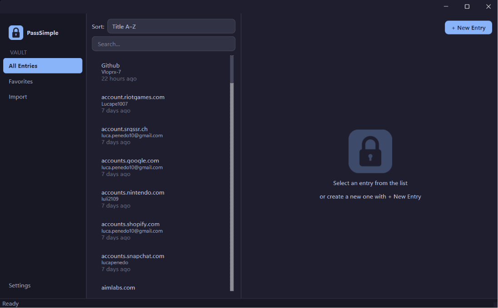
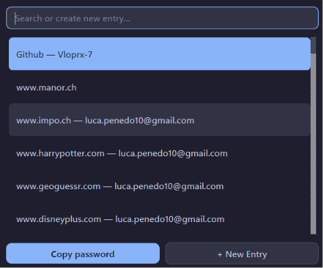
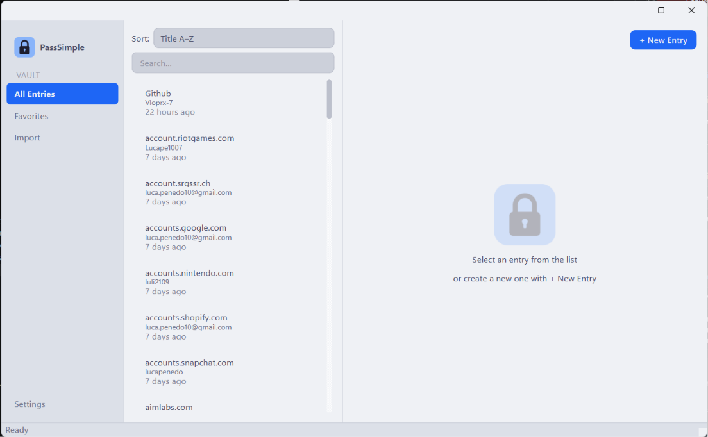
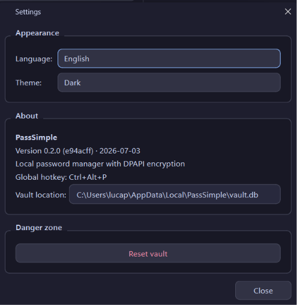

# PassSimple

Local password manager for Windows with DPAPI encryption. Personal learning project developed during vocational IT training (IT Systemtechnik, 1st year).



---

## Features

- AES-256-GCM encryption for every stored password, with a unique nonce per entry
- DPAPI-protected master key bound to the Windows user account — no separate master password required
- Automatic clipboard clear 30 seconds after copying a password
- Import from Chromium-based browsers (Chrome, Edge, Brave) via CSV
- Duplicate detection during import
- Cryptographically secure password generator (Python `secrets` module, CSPRNG)
- Favorites system
- Light and dark theme
- System tray integration
- Global hotkey Ctrl+Alt+P for quick search from anywhere

---

## Screenshots

| Main window | Quick search |
|---|---|
|  |  |

| Light theme | Settings |
|---|---|
|  |  |

---

## Installation

1. Download the latest release from the [Releases page](../../releases) (`PassSimple-Setup-X.Y.Z.exe`)
2. Run the setup (administrator rights required)
3. Follow the installer wizard and choose your options
4. Launch the app

---

## Usage

**Adding an entry:** click the `+` button in the sidebar to open the entry dialog.

**Browser import:** sidebar → Import → select a CSV file exported from Chrome, Edge, or Brave. A preview table is shown before anything is written to the vault. The importer detects duplicates and skips them.

**Quick search:** press Ctrl+Alt+P from anywhere on the system to open the floating search popup. Press Escape or click away to dismiss it.

---

## Security

- Passwords are encrypted with AES-256-GCM; each entry uses its own randomly generated 12-byte nonce
- The master key is a 32-byte random value protected by Windows DPAPI in user scope — it is bound to the Windows account and never stored in plaintext on disk
- The vault is a local SQLite database at `%LOCALAPPDATA%\PassSimple\vault.db`
- No network access, no cloud, no telemetry of any kind
- The clipboard is automatically cleared 30 seconds after copying a password
- If the Windows account is lost or the user profile is deleted, the vault cannot be recovered — DPAPI by design

---

## Development

**Requirements:** Python 3.12, Git, NSIS 3.x (for installer builds only)

```powershell
git clone https://github.com/Vlorpx-7/PassSimple.git
cd PassSimple
python -m venv .venv
.\.venv\Scripts\Activate.ps1
pip install -e .
python -m src.app
```

**Run tests:**

```powershell
python -m pytest -v
```

**Build:**

```powershell
.\build.ps1              # .exe only (PyInstaller one-file bundle)
.\build_installer.ps1    # .exe + NSIS installer
```

The build script injects the current commit hash and build date into the binary at bundle time and restores the source file to its defaults afterwards.

---

## Project Context

PassSimple is a personal learning project by a first-year IT apprentice (BBZW Sursee, specialisation Systemtechnik). The goal was to build a functional desktop application with clean architecture, real cryptography, and a proper Windows installer — going beyond tutorial-level projects.

This application is unrelated to other projects with similar names (e.g. the iOS app *PasSimple* or the SourceForge project *Pass simple*).

---

## License

MIT License — see [LICENSE](LICENSE).

---

Built with Python 3.12, PySide6, SQLite, `cryptography`, `pywin32`, PyInstaller, and NSIS.
